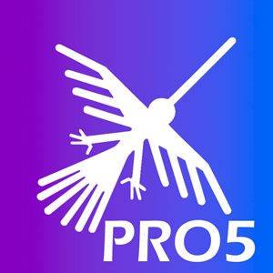

# **Facturador PRO 8**

## Términos y condiciones del uso de este repositorio

1.- Este repositorio es de código abierto pero de acceso privado, se permite la distribución y/o modificaciones si se hace referencio a la casa matriz del desarrollo de este es software es [https://facturaloperu.com](https://facturaloperu.com)

2.- Esta sección de términos y condiciones no puede ser removida al compartir o distribuir el repositorio de alguna forma, de hacerlo, [https://facturaloperu.com](https://facturaloperu.com) se reserva el derecho de remover el acceso y limitar el uso a quien lo distribuya de esa forma o a quien se atribuya el desarrollo del mismo.

3.- Si desea distribuir el código fuente como propio, debe tener al menos un 30% de modificaciones en todo el código, y previamente debe validarse dicho % por [https://facturaloperu.com](https://facturaloperu.com)

4.- El uso del software a nivel funcional es marca blanca, sin embargo a nivel de distribución del código fuente, debe contener esta sección de términos y condiciones.

5.- [https://facturaloperu.com](https://facturaloperu.com) no se hace responsable por los daños o perjuicios del uso del código de este software cuando no ha sido distribuido directamente por [https://facturaloperu.com](https://facturaloperu.com)

## Manuales de Instalación

[Windows ](https://manual.pro8.uio.la/devs/despliegue/plataformas/windows "Clic")
 
[Docker - Linux](https://manual.pro8.uio.la/devs/despliegue/plataformas/docker-linux "Clic")
 
[Linux - SSL](https://manual.pro8.uio.la/devs/despliegue/seguridad/instalar-ssl "Clic")
 
[Valet - Linux](https://manual.pro8.uio.la/devs/despliegue/plataformas/valet-linux "Clic")
 
[Linux - gestión externa de SSL](https://manual.pro8.uio.la/devs/despliegue/seguridad/gestion-externa-ssl "Clic")

### Scripts de instalación con Docker

Linux - Ubuntu 20 - 24 - Docker - SSL opcional 
[Guia](https://git.buho.la/-/snippets/12/ "Clic") 
[Script](https://git.buho.la/-/snippets/12/raw/main/newSSL.sh "Clic") 

### Manuales de actualización

-   Docker - Comandos manuales

[Con Docker](https://manual.pro8.uio.la/devs/despliegue/mantenimiento/actualizar-migrar "Clic")
 

### Manuales de actualización de SSL gratuito

-   Docker

[SSL](https://manual.pro8.uio.la/devs/despliegue/seguridad/instalar-ssl "Clic")  

[Script](https://git.buho.la/-/snippets/13 "Clic")  

[SSL AUTOMATICO](https://manual.pro8.uio.la/devs/despliegue/seguridad/ssl-cloudflare "Clic")  

### Manuales de Usuario

[Manual de usuario](https://docs.google.com/document/d/1i7yKGy3rIvv9TrnwRWZifTuZMMnZ8dbWpqcjPZ3ClmE/edit "Clic") 
[Manual de Tareas Programadas](https://manual.pro8.uio.la/devs/Manual-de-Usuario/Tareas-Programadas "Clic") 
[Manual de Cambio de Entorno (Usuario secundario)](https://manual.pro8.uio.la/devs/Manual-de-Usuario/Cambio-de-Entorno "Clic") 
[Configuración esencial para tu cuenta de facturación](https://manual.pro8.uio.la/devs/guias-adicionales/Configuracion-esencial-para-tu-cuenta-de-facturacion "Clic")

## API

[Descargar colección para Postman](https://drive.google.com/file/d/1JQctRCIZdC7K30JiizruKkPUaBSs_xml/view?usp=sharing "Clic") 
[Documentación - Ver json con respuestas](https://manual.pro8.uio.la/devs/api/introduccion "Clic") 

## Pruebas online

### Panel de administración

[URL](https://facturalo.pro "Clic")
 
Usuario: admin@gmail.com 
Contraseña: 123456

### Panel de cliente

[URL](https://empresa.pro8.uio.la/login "Clic")
 
Usuario: empresa@gmail.com 
Contraseña: empresa@gmail.com

## Manuales adicionales

### Conexión

Conexión remota al servidor: [Guía](https://manual.pro8.uio.la/devs/devops/manuales-adicionales/conexion/conexion-remota "Clic") 
Guía acceso SSH - Putty: [Guía](https://manual.pro8.uio.la/devs/devops/manuales-adicionales/conexion/conexion-ssh-putty "Clic") 
Conexión servidor Winscp: [Guía](https://manual.pro8.uio.la/devs/devops/manuales-adicionales/conexion/conexion-winscp "Clic") 
Montar proyecto en /home: [Guía](https://manual.pro8.uio.la/devs/devops/manuales-adicionales/conexion/montar-proyecto-en-home "Clic") 

### Manipulación de archivos dentro del servidor

Documentación del archivo .ENV: [Guía](https://manual.pro8.uio.la/devs/devops/manuales-adicionales/Manipular-datos/archivo-env "Clic") 
Incrementar recursos - servidor: [Guía](https://manual.pro8.uio.la/devs/devops/manuales-adicionales/Manipular-datos/recursos.servidor "Clic") 
Incrementar recursos - aplicación: [Guía](https://manual.pro8.uio.la/devs/devops/manuales-adicionales/Manipular-datos/incrementar-recursos "Clic") 
Configuracion de correo electrónico emisor: [Guía](https://manual.pro8.uio.la/devs/devops/manuales-adicionales/Manipular-datos/correo-electronico-emisor "Clic") 
Configuracion de correo emisor por cliente: [Guía](https://manual.pro8.uio.la/devs/devops/Manuales-adicionales/Manipular-datos/CORREO-ELECTR%C3%93NICO-EMISOR-cliente "Clic") 
Manual - Cambio de dominio: [Guía](https://manual.pro8.uio.la/devs/devops/Manuales-adicionales/Manipular-datos/cambio-de-dominio "Clic") 
Linux - Eliminar temporales: [Guía](https://manual.pro8.uio.la/devs/devops/manuales-adicionales/Manipular-datos/eliminar-temporales "Clic") 
Linux - Eliminar archivos por extensión: [Guía](https://manual.pro8.uio.la/devs/devops/manuales-adicionales/Manipular-datos/eliminar-archivos-por-extension "Clic") 
Configuración servidor alterno SUNAT: [Guía](https://manual.pro8.uio.la/devs/devops/manuales-adicionales/Manipular-datos/configuracion-servidor-alterno-sunat "Clic") 
Habilitar debug: [Guía](https://manual.pro8.uio.la/devs/devops/Manuales-adicionales/Manipular-datos/habilitar-debug "Clic") 
Configuración de API RUC/DNI (APIPERU): [Guía](https://manual.pro8.uio.la/devs/devops/Manuales-adicionales/Manipular-datos/configuracion-api "Clic") 
Configuración de tareas programadas (crontab-LAMP): [Guía](https://manual.pro8.uio.la/devs/devops/Manuales-adicionales/Manipular-datos/config-tareas-programadas "Clic") 

### Base de datos

Guía acceso a base de datos: [Guía](https://manual.pro8.uio.la/devs/devops/Manuales-adicionales/Acceso-DB/Guia-acceso-a-base-de-datos "Clic") 
Cambiar Contraseña root: [enlace](https://manual.pro8.uio.la/devs/devops/Manuales-adicionales/Acceso-DB/Cambiar-Contrase%C3%B1a-root "clic") 

### Docker

Iniciar servicios docker: [Guía](https://manual.pro8.uio.la/devs/devops/Manuales-adicionales/Doker/Iniciar-servicios "Clic") 
Guía generar backup: [Guía](https://manual.pro8.uio.la/devs/devops/Manuales-adicionales/Doker/Generar-backup "Clic") 
Restauración de Mysql|Docker: [Guía](https://manual.pro8.uio.la/devs/devops/Manuales-adicionales/Doker/Restauracion-MySQL "Clic") 

### Servidores

Guía incrementar espacio disco: [Guía](https://manual.pro8.uio.la/devs/devops/Manuales-adicionales/Servidores/Guia-incrementar-espacio-disco "Clic") 
Limpiar inodes: [Guía](https://manual.pro8.uio.la/devs/devops/Manuales-adicionales/Servidores/Limpiar-Inodes "Clic") 
Migración servidor: [Guía](https://manual.pro8.uio.la/devs/devops/migracion-server-docker "Clic") 
Habilitar puertos en Google Cloud: [Manual](https://manual.pro8.uio.la/devs/devops/Manuales-adicionales/Servidores/Habilitar-Puertos "clic") 

### Funcionalidades

ICBPER en POS: [Guía](https://manual.pro8.uio.la/devs/devops/Manuales-adicionales/Funcionalidades/ICBPER-en-POS "Clic") 

### Laragon

Acceso red local - laragon: [Guía](https://manual.pro8.uio.la/devs/devops/Manuales-adicionales/Laragon/Acceso-Laragol "Clic") 

### Errores comunes

Procedimiento para solucionar error 1033 SUNAT: [Guía](https://manual.pro8.uio.la/devs/devops/Manuales-adicionales/Errores-comunes/error-sunat "Clic") 

### No clasificados

Recreación de documentos: [Guía](https://manual.pro8.uio.la/devs/devops/Manuales-adicionales/No-clasificados/Recreacion-documentos "Clic") 
Manual de cambios privados: [Guía](https://manual.pro8.uio.la/devs/devops/Manuales-adicionales/No-clasificados/Crear-repositorio-independiente "Clic") 
Validador documentos: [Guía](https://manual.pro8.uio.la/devs/devops/Manuales-adicionales/No-clasificados/Validar-Documento "Clic") 

## Soporte

-   Use Issues como sistema de tickets para añadir sus sugerencias, problemas o inquietudes
-   Inconvenientes con facturación serán atendidos con prioridad
-   Una vez obtiene acceso al repositorio tendrá un año de vigencia, pasado el año debe renovar su contrato
-   Toda instalación es gestionada mediante los canales de Slack
-   Nuevas instalaciones o actualizaciones deben ser programadas y gestionadas, para ser ejecutada el mismo día debe haber un problema previo

## FacturaloPeru

[facturaloperu.com](http://facturaloperu.com "Clic") 
soporte@facturaloperu.com 
wsapp: 930 973 902 
# pro8
